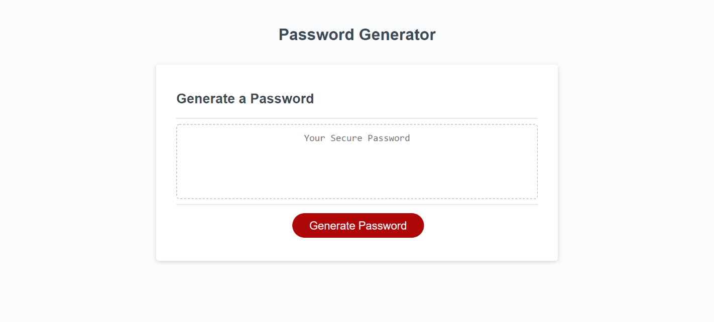

# Password-Generator

## Contents

* [Introduction](#Introduction)
* [Technologies](#Technologies)
* [Screenshot](#Screenshot)
* [Link](#Link)

## Introduction

Password Generator project generate the password by asking the user for their provide inputs.The user has to select the password based on given criteria:

* The password length should be between 1 to 128 character.
* The password should contain atleast one or more from the lowercase,uppercase, number and special characters.

## Technologies

Project is created with:

* Visual Studio Code 1.51.1

## Screenshot

## Link

[Password Generator](https://panwaramita.github.io/Password-Generator/)
